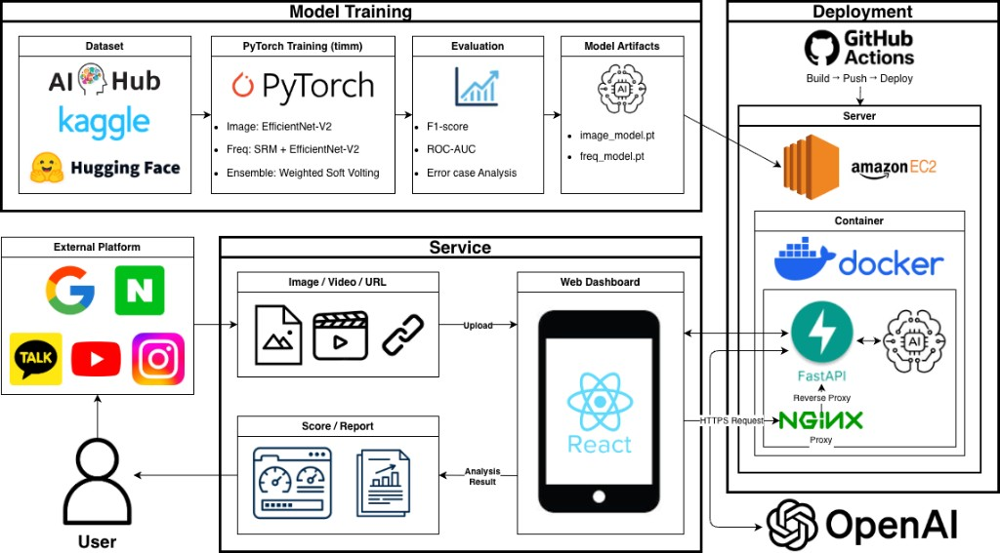

<p align="center">
  
</p>

<h1 align="center">🕵️ DBDBDEEP — Multimodal Deepfake Detector</h1>

<p align="center">
  사진 · 영상 · URL 한 장만으로 딥페이크를 즉시 판별하는 <b>실시간 AI 검증 플랫폼</b>
</p>

<p align="center">
  멋쟁이사자처럼 AI CV 단기심화 부트캠프 3기 | <b>팀 디비디비딥 (DBDBDEEP)</b>
</p>

<p align="center">
  
  
  
  
  
  
</p>

---

## 📌 목차

1. [기획 배경](#-기획-배경--문제-정의)
2. [프로젝트 목표 및 기대효과](#-프로젝트-목표--기대효과)
3. [기존 서비스와 차별점](#-기존-서비스와-차별점)
4. [서비스 개요](#-서비스-개요)
5. [핵심 기능](#-핵심-기능)
6. [시스템 아키텍처](#-시스템-아키텍처)
7. [데이터셋](#-데이터셋)
8. [모델 설계](#-모델-설계)
   - [Image Model](#1️⃣-image-model--efficientnet-v2-s)
   - [Frequency Model](#2️⃣-frequency-model--srm--efficientnet-v2-s)
   - [Ensemble](#3️⃣-ensemble--weighted-soft-voting)
9. [분석 리포트](#-분석-리포트-xai)
10. [사용 방법](#-사용-방법)
11. [팀원](#-팀원)

---

## 🚨 기획 배경 · 문제 정의

> **"사진 한 장만으로는 이제 진짜와 가짜를 구분할 수 없다."**

생성형 AI의 고도화로 **육안으로는 식별 불가능한 수준**의 딥페이크 이미지가 범람하고 있습니다.

| 문제 | 현황 |
|---|---|
| 📱 데이팅 앱·SNS 확산 | 비대면 신뢰 공백 확대 |
| 🤖 Diffusion 기반 생성 AI | 완벽한 가상 인물 생성 가능 |
| 💔 로맨스 스캠·사칭 범죄 급증 | 개인이 대응하기 어려운 수준 |
| 🚫 대중적 방어 수단 부재 | 실시간 검증 가능한 서비스 없음 |

👉 **누구나 즉시 사용 가능한 실시간 딥페이크 검증 시스템**이 필요합니다.

---

## 🎯 프로젝트 목표 · 기대효과

### 목표

| 목표 | 설명 |
|---|---|
| ⚡ Real-time Detection Engine | 업로드 즉시 딥페이크 여부 판별하는 고성능 추론 엔진 |
| 🔬 Multi-Modal 신호 분석 | 픽셀 변조 흔적 + 주파수(Frequency) 특성 결합으로 탐지 정확도 향상 |
| 🧠 Explainable AI (XAI) | Grad-CAM 히트맵 + Confidence Score로 분석 근거 시각화 |
| 🛡️ 디지털 안전망 구축 | 로맨스 스캠 등 디지털 범죄 사전 예방 |

### 기대 효과

- **데이터 기반 객관적 의사결정** — 감이 아닌 AI 신뢰 점수(%)로 진위 여부 합리적 판단
- **디지털 사기 피해 선제적 차단** — 조작 이미지 사전 탐지로 잠재적 피해 예방
- **탐지 기술의 대중화** — 연구·수사기관 중심 기술을 일반 사용자 B2C 서비스로 확장
- **플랫폼 확장성 확보** — API 기반 구조로 데이팅 앱·SNS·중고거래 등 다양한 서비스 연동

---

## 🆚 기존 서비스와 차별점

| 구분 | 기존 서비스 | **DBDBDEEP** |
|---|---|---|
| 탐지 대상 | 특정 기법에 한정 (GAN 위주) | **최신 Diffusion·Transformer 기반까지 대응** |
| 입력 지원 | 이미지 단일 분석 | **Image / Video / URL 멀티 입력** |
| 분석 방식 | 단일 모델 | **Pixel + Frequency 이중 탐지 앙상블** |
| 설명 가능성 | 점수만 제공 | **Grad-CAM + LLM 기반 자연어 리포트** |
| 접근성 | 전문가 도구 수준 | **누구나 사용 가능한 UI/UX** |

---

## 🖥️ 서비스 개요

```
사용자 (SNS·메신저에서 수상한 프로필 발견)
        │
        ▼
  이미지 / 영상 / URL 업로드
        │
        ▼
 ┌─────────────────────────────┐
 │   DBDBDEEP Detection Engine │
 │  ┌──────────┐ ┌───────────┐ │
 │  │  Image   │ │  Frequency│ │
 │  │  Model   │ │   Model   │ │
 │  │(RGB 3ch) │ │(SRM+Y 4ch)│ │
 │  └────┬─────┘ └─────┬─────┘ │
 │       └──────┬───────┘      │
 │   Weighted Soft Voting      │
 │   0.37·p_img + 0.63·p_freq  │
 └──────────────┬──────────────┘
                │
                ▼
   Real Score (%) · Risk Level · Grad-CAM
```

---

## ✨ 핵심 기능

### 1️⃣ 멀티 입력 지원
| 입력 방식 | 설명 |
|---|---|
| 📷 Image | 이미지 파일 직접 업로드 |
| 🎥 Video | 영상 프레임 단위 분석 |
| 🔗 URL | URL에서 이미지 자동 추출 분석 |

### 2️⃣ 이중 탐지 모델
- **Image Model** : EfficientNet-V2-S — 픽셀 수준 텍스처 아티팩트 탐지
- **Frequency Model** : SRM + EfficientNet-V2-S — 주파수 도메인 위조 흔적 탐지
- → 두 관점의 신호를 동시에 분석하여 탐지 강건성 확보

### 3️⃣ Weighted Soft Voting 앙상블
- Grid Search 기반 F1-Macro 최적 가중치 탐색
- **최종 수식 : `0.37 × p_image + 0.63 × p_freq`**

### 4️⃣ Explainable AI 리포트
- 🔥 **Grad-CAM** 히트맵 — 모델이 주목한 위조 영역 시각화
- 📊 **Confidence Score** — 0~100 Real/Fake 신뢰 점수
- ⚠️ **위험 단계** — REAL / WARNING / FAKE 3단계 분류 (p_real 기준)
- 🤖 **LLM 자연어 리포트** — GPT 기반 분석 결과 자동 설명

### 5️⃣ User Flow
```
1. 검증 대상 선택  →  SNS·메신저에서 의심 이미지 저장 또는 URL 복사
2. 플랫폼 업로드  →  이미지 / 영상 업로드 또는 URL 입력 후 "AI 분석 시작"
3. 결과 확인      →  Real Score(%) + 위험 단계 + Grad-CAM 리포트
4. 신뢰도 판단   →  콘텐츠 진위 판단 참고자료로 활용
```

---

## 🏗️ 시스템 아키텍처

<p align="center">
  
</p>

| 레이어 | 기술 |
|---|---|
| **Model Training** | PyTorch · timm · Google Colab (A100) |
| **Backend API** | FastAPI · Redis |
| **Frontend** | React |
| **Infra** | AWS EC2 · Docker · NGINX · GitHub Actions |
| **AI Report** | Grad-CAM · OpenAI GPT |

---

## 📦 데이터셋

### 학습 데이터

| 분류 | 출처 | 비고 |
|---|---|---|
| Real | FaceForensics++, FFHQ, Celeb-DF | 공개 데이터셋 |
| Fake | FaceForensics++, Celeb-DF, FaceSwapGAN | 공개 데이터셋 |
| Fake (Custom) | FLUX, Qwen, Kolors, Stable Diffusion | 최신 Diffusion 모델 직접 생성 |

> 최신 생성 모델 데이터를 직접 구축하여 일반화 성능을 강화했습니다.

### 평가용 테스트 데이터셋 (3,968장 · Real : Fake = 1:1)

| 구분 | 폴더명 | 수량 | 설명 |
|---|---|---|---|
| Real | ffhq | 1,000 | FFHQ (학습 미사용) |
| Real | real_celeb | 984 | 실제 셀럽 이미지 |
| Fake | Celeb_Deepfake_Files | 984 | 셀럽 Face Swap |
| Fake | SFHQ_part2 | 500 | SFHQ Part2 (학습 미사용) |
| Fake | SFHQ_part4 | 500 | SFHQ Part4 (학습 미사용) |

### 전처리 파이프라인

```
원본 이미지
    │
    ▼  RetinaFace 얼굴 검출
    │  Bounding Box 확장 (margin 15%)
    ▼  224×224 Crop & Resize
    │
    ├──► [Image Model용]  RGB 정규화 (ImageNet mean/std)
    │
    └──► [Freq Model용]   YCrCb 변환 → SRM 필터 3종 적용
                          → SRM×3 + Y채널 4ch .npy 저장
```

---

## 🧠 모델 설계

### 1️⃣ Image Model — EfficientNet-V2-S

> 픽셀 수준의 국소 텍스처 아티팩트를 학습하는 RGB 기반 분류 모델

**학습 전략**

| 항목 | 설정 |
|---|---|
| Backbone | EfficientNet-V2-S (ImageNet pretrained) |
| 입력 | RGB 3ch · 224×224 |
| Augmentation | ColorJitter + RandomAffine + GaussianBlur + RandomErasing |
| Optimizer | AdamW `lr=8e-5` `wd=0.01` |
| Loss | BCEWithLogitsLoss + **Label Smoothing** (α=0.1) |
| Batch / Epoch | 128 / 5 |

**성능 (Test Set)**

```
              precision    recall  f1-score
        Real     0.7792    0.8432    0.8100
        Fake     0.8292    0.7611    0.7937
   macro avg     0.8042    0.8022    0.8018

  AUC-ROC : 0.8903
```

📈 **베이스라인 대비 F1-Macro : `0.5900 → 0.8013` (+35.8%)**

---

### 2️⃣ Frequency Model — SRM + EfficientNet-V2-S

> 주파수 도메인의 고주파 위조 흔적을 탐지하는 4채널 기반 분류 모델

**SRM (Steganalysis Rich Model) 입력 구성**

```
원본 이미지 Y채널
    │
    ├── SRM Filter 1 (Laplacian 계열)   → ch 0
    ├── SRM Filter 2 (2D 2차 미분)      → ch 1
    ├── SRM Filter 3 (수평 잔차)         → ch 2
    └── Y 채널 (원본 밝기)               → ch 3
                        ↓
            (B, 4, 224, 224) Tensor
```

**학습 전략**

| 항목 | 설정 |
|---|---|
| Backbone | EfficientNet-V2-S (4ch 입력, ImageNet weight transfer) |
| Augmentation | Flip + Rotation + RandomErasing + **Online Gaussian Noise** (p=0.3) |
| Sampler | **WeightedRandomSampler** (클래스 불균형 대응) |
| Optimizer | AdamW `lr=1e-4` `wd=0.15` |
| Scheduler | **OneCycleLR** (pct_start=0.3) |
| 정규화 | **Mixup** (α=0.4) + Dropout 0.6 |
| AMP | autocast + GradScaler |
| Batch / Epoch | 48 / 30 |

**성능 (Test Set)**

```
              precision    recall  f1-score
        Real     0.9575    0.9078    0.9320
        Fake     0.9123    0.9597    0.9354
   macro avg     0.9349    0.9337    0.9337

  AUC-ROC : 0.9840
```

📈 **베이스라인 대비 F1-Macro : `0.7821 → 0.9337` (+19.4%)**

---

### 3️⃣ Ensemble — Weighted Soft Voting

> 두 모델의 출력 확률을 가중 평균으로 결합

**비교 전략**

| 전략 | 수식 |
|---|---|
| Simple Average | `(p_img + p_freq) / 2` |
| **Weighted Average** ✅ | **`w·p_img + (1-w)·p_freq`** |
| Geometric Mean | `√(p_img × p_freq)` |
| Max Rule | `max(p_img, p_freq)` |
| Min Rule | `min(p_img, p_freq)` |
| Logit Average | `σ((logit(p_img) + logit(p_freq)) / 2)` |

**최적 가중치 탐색 (Grid Search, F1-Macro 기준)**

- F1-Macro 허용 오차(tol=0.005) 이내 후보 중 **0.5에 가장 가까운 w 선택** (균등 앙상블 우선)
- **최종 수식 : `Final = 0.37 × p_image + 0.63 × p_freq`**

**최종 성능 (Test Set)**

| 모델 | F1 (Macro) | AUC-ROC |
|---|---|---|
| Image Only (baseline → final) | 0.5900 → 0.8013 | 0.8903 |
| Frequency Only (baseline → final) | 0.7821 → 0.9337 | 0.9840 |
| **Ensemble** | **0.9410** | **0.9789** |

---

## 📊 분석 리포트 (XAI)

```
모델 예측 확률 (p_fake, p_real)
        +
Grad-CAM 히트맵 (위조 의심 영역 시각화)
        │
        ▼
  GPT 기반 LLM
        │
        ▼
 자연어 분석 리포트 자동 생성
 (위조 근거, 신뢰도 설명, 주의 권고)
```

- **위험 단계** (p_real 기준)

| 단계 | 조건 | Score 범위 |
|---|---|---|
| ✅ **REAL** | p_real ≥ 0.520 | Real Score ≥ 52 |
| ⚠️ **WARNING** | 0.335 ≤ p_real < 0.520 | Real Score 33.5 ~ 51.9 |
| 🚨 **FAKE** | p_real < 0.335 | Real Score < 33.5 |
- Grad-CAM으로 모델이 주목한 위조 영역을 히트맵으로 직관적 시각화
- GPT API 연동으로 탐지 근거를 자연어로 자동 설명

---

## 🚀 사용 방법

### 서버 실행 (추론)

모델 가중치(`image.pth`, `freq.pt`)가 Git LFS로 저장소에 포함되어 있습니다.

```bash
# 1. 저장소 clone (LFS 파일 포함)
git clone https://github.com/gksqkf0824-commits/dbdbdeep-deepfake-detector.git
cd dbdbdeep-deepfake-detector

# 2. 의존성 설치
pip install -r requirments.txt

# 3. Redis 실행 (Docker)
docker run -p 6379:6379 -d redis

# 4. 서버 실행
uvicorn main:app --host 0.0.0.0 --port 8000 --reload
```

> **Git LFS 미설치 시** `git lfs install` 후 `git lfs pull` 로 가중치 파일을 받아주세요.

### API 사용 예시

```bash
# 이미지 분석
curl -X POST http://localhost:8000/analyze \
  -F "file=@your_image.jpg"

# 결과 조회 (토큰으로 1시간 내 재조회 가능)
curl http://localhost:8000/get-result/{token}
```

**응답 예시**
```json
{
  "data": {
    "fake_score": 82.4,
    "real_score": 17.6,
    "p_image": 0.7801,
    "p_freq": 0.8512,
    "is_fake": true,
    "risk_level": "Danger"
  }
}
```

### 학습 (재현)

<details>
<summary>Image Model 학습</summary>

```bash
python train_image.py \
  --data  /path/to/dataset \
  --save  image.pth \
  --epochs 5 \
  --batch  128 \
  --lr     8e-5
```
</details>

<details>
<summary>Frequency Model 학습</summary>

```bash
# Step 1: 이미지 → SRM .npy 전처리 (최초 1회)
python train_freq.py preprocess \
  --data /path/to/raw_dataset \
  --out  /path/to/freq_data

# Step 2: 학습
python train_freq.py train \
  --data  /path/to/freq_data \
  --save  freq.pt \
  --epochs 30 \
  --batch  48
```
</details>

---

## 🛠️ 기술 스택

<p align="center">
  
  
  
  
  
  
  
  
  
  
  
  
</p>

| 분류 | 기술 |
|---|---|
| **모델 학습** | PyTorch · timm · scikit-learn |
| **데이터 전처리** | OpenCV · RetinaFace · InsightFace · NumPy |
| **시각화** | Matplotlib · Seaborn · Grad-CAM |
| **개발 환경** | Google Colab Pro+ (A100 GPU) · CUDA |
| **Backend** | FastAPI · Redis |
| **Frontend** | React |
| **배포** | AWS EC2 · Docker · NGINX · GitHub Actions |
| **AI Report** | OpenAI GPT API |

---

## 👥 팀원

| 이름 | 역할 |
|---|---|
| **조영준** (팀장) | 이미지 모델 · 데이터 구축 |
| **권소윤** | 이미지 모델 · Frontend / Backend |
| **주요셉** | 이미지 모델 · Frontend |
| **신동혁** | 주파수 모델 · Backend |
| **장은태** | 주파수 모델 · Frontend · 영상 제작 |

---

<p align="center">
  <b>"Can you trust what you see?" — DBDBDEEP이 답합니다. 🕵️</b>
</p>
